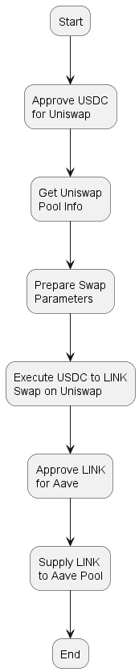

# DeFi Token Swap and Supply Script

## Overview of Script

This script demonstrates the integration of multiple DeFi protocols to perform a series of actions:

1. Swap USDC for LINK tokens using Uniswap V3 on the Sepolia testnet.
2. Supply the acquired LINK tokens to the Aave lending protocol.

The script interacts with the following protocols and contracts:

- Uniswap V3: For token swapping
- Aave V3: For supplying tokens to the lending pool

The workflow is as follows:

1. Approve USDC spending for Uniswap
2. Swap USDC for LINK using Uniswap V3
3. Approve LINK spending for Aave
4. Supply LINK to the Aave lending pool

## Diagram Illustration



## Code Explanation
### Setup and Initialization
The script begins by importing necessary libraries and ABIs:
```
import { ethers } from "ethers";
import FACTORY_ABI from "./abis/factory.json" assert { type: "json" };
import SWAP_ROUTER_ABI from "./abis/swaprouter.json" assert { type: "json" };
import POOL_ABI from "./abis/pool.json" assert { type: "json" };
import TOKEN_ABI from "./abis/token.json" assert { type: "json" };
import AAVE_POOL_ABI from "./abis/aavePool.json" assert { type: "json" };
```
It then sets up environment variables and defines contract addresses:
```
const POOL_FACTORY_CONTRACT_ADDRESS = "0x0227628f3F023bb0B980b67D528571c95c6DaC1c";
const SWAP_ROUTER_CONTRACT_ADDRESS = "0x3bFA4769FB09eefC5a80d6E87c3B9C650f7Ae48E";
const AAVE_POOL_ADDRESS = "0x7d2768dE32b0b80b7a3454c06BdAc94A69DDc7A9";
```
### Token Approval
The **approveToken** function handles token approvals for both Uniswap and Aave:
```
async function approveToken(tokenAddress,tokenABI, amount, decimals, wallet, spenderAddress) {
  try {
    const tokenContract = new ethers.Contract(tokenAddress, tokenABI, wallet);
    const approveAmount = ethers.parseUnits(amount.toString(), decimals);
    const approveTransaction = await tokenContract.approve.populateTransaction(
      spenderAddress,
      approveAmount
    );
    const transactionResponse = await wallet.sendTransaction(
      approveTransaction
    );
    console.log(`-------------------------------`);
    console.log(`Sending Approval Transaction...`);
    console.log(`-------------------------------`);
    console.log(`Transaction Sent: ${transactionResponse.hash}`);
    console.log(`-------------------------------`);
    const receipt = await transactionResponse.wait();
    console.log(
      `Approval Transaction Confirmed! https://sepolia.etherscan.io/tx/${receipt.hash}`
    );
  } catch (error) {
    console.error("An error occurred during token approval:", error);
    throw new Error("Token approval failed");
  }
}
```
### Uniswap Interaction
The script interacts with Uniswap through several functions:

* **getPoolInfo**: Retrieves information about the Uniswap pool for the token pair.
* **prepareSwapParams**: Prepares the parameters for the token swap.
* **executeSwap**: Executes the token swap on Uniswap.
### Aave Interaction
The **supplyToAave** function handles supplying tokens to the Aave lending pool:
```
async function supplyToAave(tokenAddress, amount, signer) {
  const aavePool = new ethers.Contract(
    AAVE_POOL_ADDRESS,
    AAVE_POOL_ABI,
    signer
  );

  try {
    const supplyTx = await aavePool.deposit(
      tokenAddress,
      amount,
      signer.address,
      0
    );
    console.log(`-------------------------------`);
    console.log(`Supplying to Aave...`);
    console.log(`-------------------------------`);
    console.log(`Transaction Sent: ${supplyTx.hash}`);
    console.log(`-------------------------------`);
    const receipt = await supplyTx.wait();
    console.log(
      `Supply Transaction Confirmed! https://sepolia.etherscan.io/tx/${receipt.hash}`
    );
  } catch (error) {
    console.error("An error occurred during Aave supply:", error);
    throw new Error("Aave supply failed");
  }
}
```

### Main Workflow
The **main** function orchestrates the entire process:

1. Approves USDC for Uniswap
2. Retrieves pool information
3. Prepares and executes the swap
4. Approves LINK for Aave
5. Supplies LINK to Aave

```
async function main(swapAmount) {
  const inputAmount = swapAmount;
  const amountIn = ethers.parseUnits(inputAmount.toString(), USDC.decimals);

  try {
    // Step 1: Swap USDC for LINK
    await approveToken(USDC.address, TOKEN_ABI, inputAmount, USDC.decimals, signer, SWAP_ROUTER_CONTRACT_ADDRESS);
    const { poolContract } = await getPoolInfo(factoryContract, USDC, LINK);
    const params = await prepareSwapParams(poolContract, signer, amountIn);
    const swapRouter = new ethers.Contract(
      SWAP_ROUTER_CONTRACT_ADDRESS,
      SWAP_ROUTER_ABI,
      signer
    );
    await executeSwap(swapRouter, params, signer);

     // Step 2: Approve LINK for Aave
     const amountOut = params.amountIn;
     const linkContract = new ethers.Contract(LINK.address, TOKEN_ABI, signer);
     
     const approveTransaction = await linkContract.approve.populateTransaction(
      AAVE_POOL_ADDRESS,
      amountOut
    );
    const approvalResponse = await signer.sendTransaction(approveTransaction);
    await approvalResponse.wait();

     // Step 3: Supply LINK to Aave
    await supplyToAave(LINK.address, amountOut, signer);
  } catch (error) {
    console.error("An error occurred:", error.message);
  }
}
```
The script demonstrates the composability of DeFi protocols by chaining together a token swap on Uniswap with a token supply on Aave, all within a single transaction flow.
